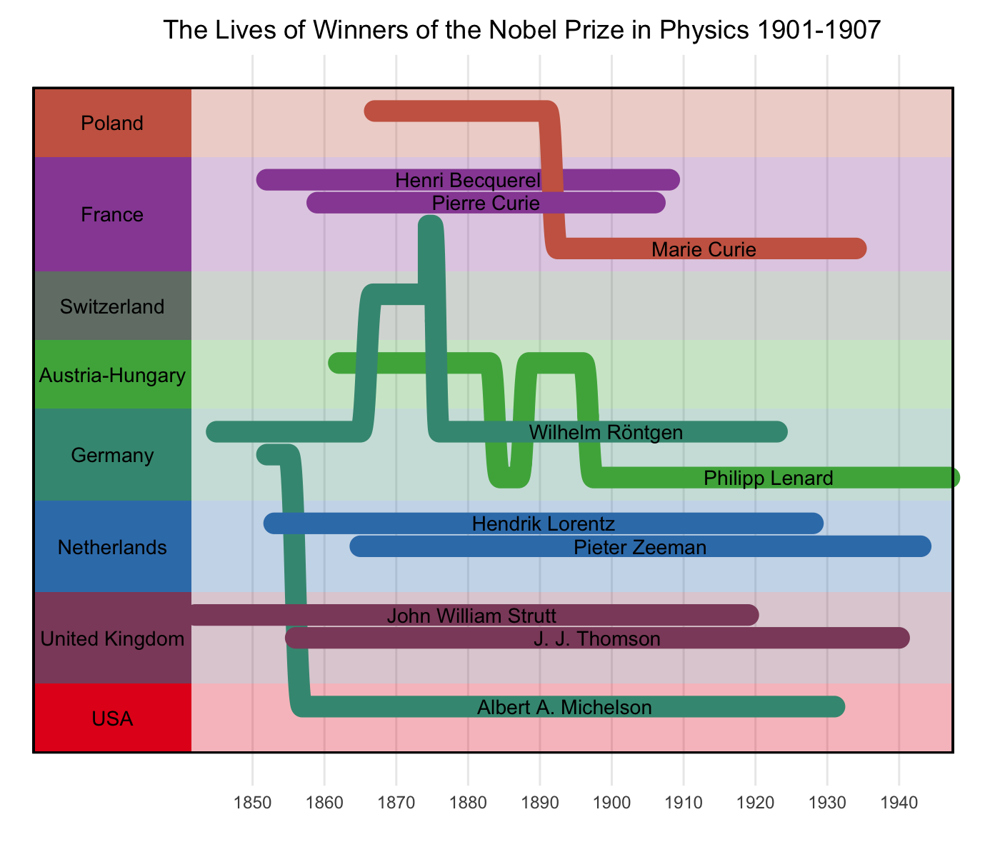

# wormsplot

A worms plot is an elegant way to visualize historical (or fictional!)
characters as they move from place to place. Expanding on `ggplot2`,
this package provides a new geom, `geom_worm`, which allows for an
arbitrary number of moves within each worm, and takes intuitively
structured data input. The package also includes a convenience function,
`wormsplot`, for generating aesthetic plots with minimal effort.

License: GPL-2

## Installation

You can install the development version of wormsplot from
[GitHub](https://github.com/) with:

``` r
# install.packages("devtools")
devtools::install_github("rimonim/wormsplot")
```

## Example

Here is a plot of the lives of scientists who won the Nobel Prize for
physics between 1901 and 1907.

``` r
library(tidyverse)
#> ── Attaching packages ─────────────────────────────────────── tidyverse 1.3.2 ──
#> ✔ ggplot2 3.4.0     ✔ purrr   1.0.1
#> ✔ tibble  3.1.8     ✔ dplyr   1.1.0
#> ✔ tidyr   1.3.0     ✔ stringr 1.5.0
#> ✔ readr   2.1.3     ✔ forcats 0.5.2
#> ── Conflicts ────────────────────────────────────────── tidyverse_conflicts() ──
#> ✖ dplyr::filter() masks stats::filter()
#> ✖ dplyr::lag()    masks stats::lag()
library(wormsplot)

data(nobel_physicists)

nobel_physicists %>%
  filter(name %in% head(unique(name), 10)) %>%
  mutate(country = forcats::fct_drop(country)) %>%
  wormsplot('year', 'country', 'name', color = 'initial',
            linewidth = 5, region.label.width = 19, size = 3) +
  labs(title = "The Lives of Winners of the Nobel Prize in Physics 1901-1907")
```



Plots can also be built from scratch using `geom_worm()`:

``` r
library(ggplot2)

data <- data.frame(
  x = c(5, 10, 25, 30, 15, 20, 25),
  y = c(1, 2, 1.5, 1.5, 2.2, 1.2, 1.2),
  person = c('Me', 'Me', 'Me', 'Me', 'You', 'You', 'You')
  )

ggplot(data, aes(x, y, group = person, color = person)) +
  geom_worm(linewidth = 10, shorten_lines = 10) +
  theme_minimal()
```


